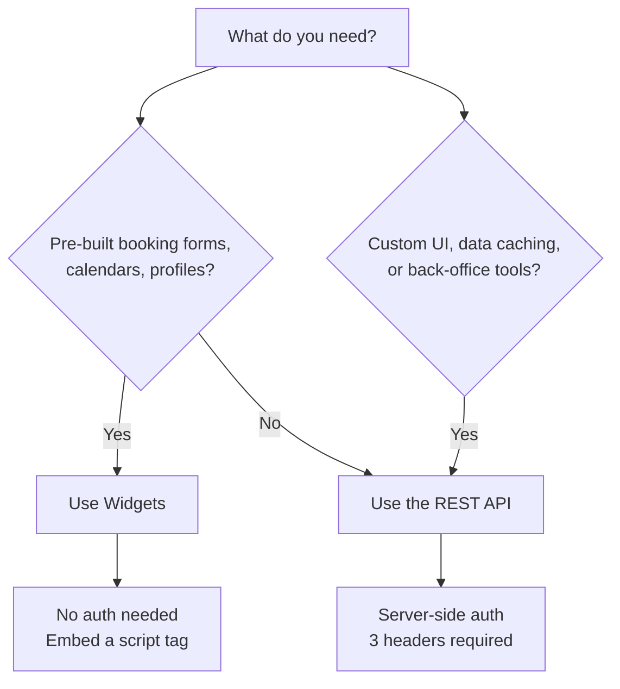

# API overview

The Zooza REST API gives you programmatic access to manage programmes, classes, registrations, payments, and more. All responses are JSON.

## When to use the REST API

Zooza offers two integration approaches: **widgets** (embeddable UI components) and the **REST API** (programmatic access). They are not mutually exclusive — many integrations use both.

**Use widgets** when you want to embed ready-made Zooza components (registration forms, calendars, maps, profiles) on your website. No server code or authentication required — just a script tag. See the [widget docs](../widgets/index.md).

**Use the REST API** when you need to:

- Build admin or back-office applications
- Cache classes and courses on your website for custom customer journeys
- Build a fully custom customer-facing UI
- Automate workflows or synchronise data with external systems

!!! note "Different API keys"
    Widget API keys and REST API keys are **not interchangeable**. A widget key cannot be used for REST API calls. See [concepts](../concepts.md#api-keys) for details.

---

## Base URLs

| Region | Base URL |
|--------|----------|
| Europe | `https://api.zooza.app` |
| UK | `https://uk.api.zooza.app` |
| UAE | `https://asia.api.zooza.app` |

All examples in this documentation use the Europe base URL. Replace it with your region's URL as needed.

---

## Authentication

The REST API requires three headers on every request:

| Header | Description |
|--------|-------------|
| `X-ZOOZA-API-KEY` | Your REST API key (from Zooza support) |
| `X-ZOOZA-TOKEN` | User token obtained via login |
| `X-ZOOZA-COMPANY` | Scopes requests to a specific company |

For full details on obtaining credentials and tokens, see the [authentication guide](authentication.md).

---

## Key concepts

Zooza uses specific terminology (e.g. "course" in the API means "programme" in the UI). See the [concepts and glossary](../concepts.md) page for definitions of all terms.

---

## Rate limiting

<!-- TODO: requires clarification — what are the rate limits? -->

Rate limit details will be documented here.

---

## Versioning

<!-- TODO: requires clarification — versioning policy, current version is v1 -->

The current API version is **v1**. All endpoints are prefixed with `/v1/`.

---

## Endpoints reference

See the full [endpoints reference](endpoints.md) for available API operations.
