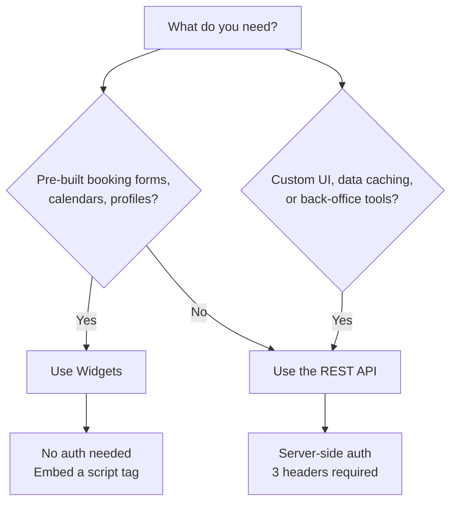

import AiPrompt from '@site/src/components/AiPrompt';

# API overview

The Zooza REST API gives you programmatic access to manage programmes, classes, registrations, payments, and more. All responses are JSON.

## When to use the REST API

Zooza offers two integration approaches: **widgets** (embeddable UI components) and the **REST API** (programmatic access). They are not mutually exclusive — many integrations use both.

```mermaid
flowchart TD
    A["What do you need?"] --> B{"Pre-built booking forms,\ncalendars, profiles?"}
    B -- Yes --> C["Use Widgets"]
    B -- No --> D["Use the REST API"]
    A --> E{"Custom UI, data caching,\nor back-office tools?"}
    E -- Yes --> D
    C --> F["No auth needed\nEmbed a script tag"]
    D --> G["Server-side auth\n3 headers required"]
```

**Use widgets** when you want to embed ready-made Zooza components (registration forms, calendars, maps, profiles) on your website. No server code or authentication required — just a script tag. See the [widget docs](../widgets/index.md).

**Use the REST API** when you need to:

- Build admin or back-office applications
- Cache classes and courses on your website for custom customer journeys
- Build a fully custom customer-facing UI
- Automate workflows or synchronise data with external systems

:::note Different API keys
Widget API keys and REST API keys are **not interchangeable**. A widget key cannot be used for REST API calls. See [concepts](../concepts.md#api-keys) for details.
:::

<AiPrompt task="Build a Zooza REST API integration">{`Help me build an integration against the Zooza REST API.

Read the full Zooza API documentation first — it contains the complete endpoint reference, auth flow, base URLs, and error codes:
https://docs.zooza.online/llms-full.txt

Authentication uses three headers: X-ZOOZA-API-KEY, X-ZOOZA-TOKEN (from POST /v1/login), and X-ZOOZA-COMPANY (from GET /v1/user). Base URLs: Europe https://api.zooza.app, UK https://uk.api.zooza.app, UAE https://asia.api.zooza.app.

What I want to build:
[describe your use case — e.g. "list all programmes and export enrolled clients to CSV", "sync new bookings into my CRM", or "a back-office tool to manage payments"]

Tasks:
1. Set up authentication (login -> token -> company id) in [my language: Node.js / Python / PHP / cURL].
2. Implement the use case above using the correct endpoints from the docs — don't invent endpoints; cite the ones you use.
3. Handle pagination, errors, and token expiry (401) gracefully.

Ask me for my REST API key, login email, client secret, and region before writing code that runs.`}</AiPrompt>

---

## Base URLs

| Region | Base URL |
|--------|----------|
| Europe | `https://api.zooza.app` |
| UK | `https://uk.api.zooza.app` |
| UAE | `https://asia.api.zooza.app` |

All examples in this documentation use the Europe base URL. Replace it with your region's URL as needed.

---

## Authentication

The REST API requires three headers on every request:

| Header | Description |
|--------|-------------|
| `X-ZOOZA-API-KEY` | Your REST API key (from Zooza support) |
| `X-ZOOZA-TOKEN` | User token obtained via login |
| `X-ZOOZA-COMPANY` | Scopes requests to a specific company |

For full details on obtaining credentials and tokens, see the [authentication guide](authentication.md).

---

## Key concepts

Zooza uses specific terminology (e.g. "course" in the API means "programme" in the UI). See the [concepts and glossary](../concepts.md) page for definitions of all terms.

---

## Rate limiting

<!-- TODO: requires clarification — what are the rate limits? -->

Rate limit details will be documented here.

---

## Versioning

<!-- TODO: requires clarification — versioning policy, current version is v1 -->

The current API version is **v1**. All endpoints are prefixed with `/v1/`.

---

## Endpoints reference

See the full [API operations reference](reference) for all available endpoints.
