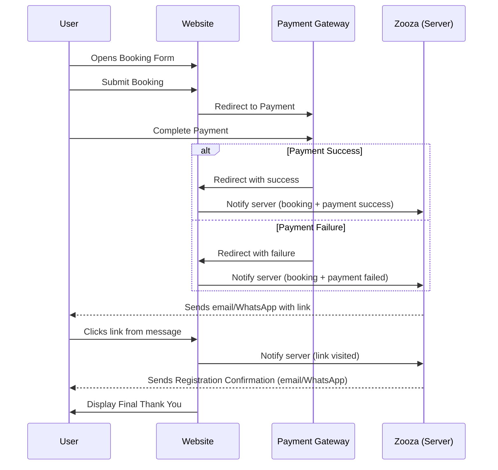
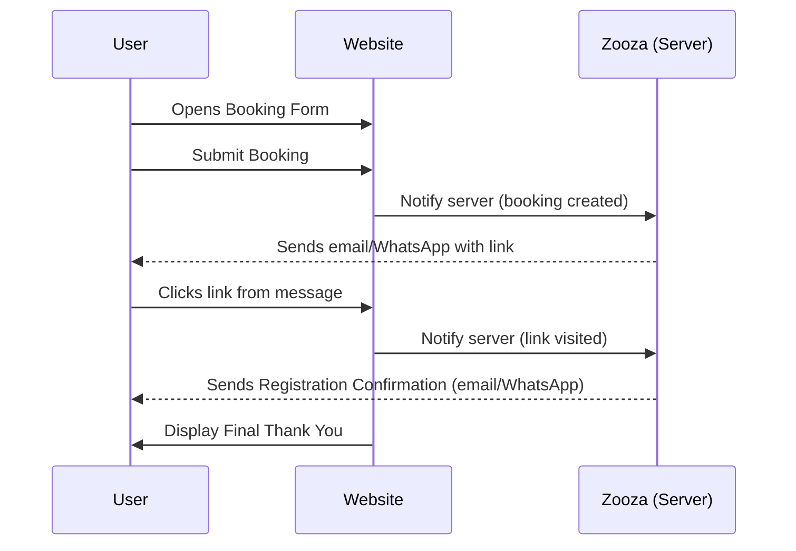

# Registration/Booking Widget

**This widget is used to place the registration / booking form to your website. You can place as many instances of this widget as you wish, there is no limit on this. Each form can have many of its settings overriden per instance. This allows you to pre-filter the classes that are listed in the form, or change its appearance and behaviour based on the use case you're solving.**

## Installation

### WordPress

When your WordPress plugin is installed, just head to `Settings > Zooza` and from dropdown of pages, select a page where you want the form to appear.

#### Shortcodes

You can also use shortcodes to place the form anywhere within the page. More configuration options for shortcodes is described below in their respective sections.

```plaintext
[zooza type="registration"]
```

### Wix

In Wix editor, click on Zooza widget. In the `Settings` panel, enter the api key and as a widget choose `Registration`.

### Embed code

Place the following snippet directly into the `<body>` of your page, where you want the booking form to appear.

| Placeholder        | Description                                                                                  | Example Value                |
|--------------------|---------------------------------------------------------------------------------------------|------------------------------|
| `YOUR_API_KEY`     | Replace with the API key found in the application under `Publish > Widget`. Appears twice.  | `abc123xyz`                  |
| `ZOOZA_API_URL`    | Replace with the Zooza API URL for your region:<br>- Europe: `https://api.zooza.app`<br>- UK: `https://uk.api.zooza.app`<br>- UAE: `https://asia.api.zooza.app` | `https://api.zooza.app`      |


```javascript
<script data-version='v1' data-widget-id='zooza' id='YOUR_API_KEY' type='text/javascript'>
( function() {
function async_load(){
	document.body.setAttribute('data-zooza-api-url', 'ZOOZA_API_URL');
	var s = document.createElement('script'); s.type = 'text/javascript'; s.async = true;
	s.src = document.body.getAttribute('data-zooza-api-url') +
	 '/widgets/v1/?type=registration&ref=' + encodeURIComponent( window.location.href );
	var embedder = document.getElementById( 'YOUR_API_KEY' );
	embedder.parentNode.insertBefore( s, embedder );
}
if ( window.attachEvent ) {
	window.attachEvent( 'onload', async_load );
} else {
	window.addEventListener( 'load', async_load, false );
}
} )();
</script>
```

## Settings

These settings are managed within the Zooza's main application `Publish > Widget > Registration Form`.

### URL

Probably most important setting there is. This will let Zooza know where your widget resides so that it can [redirect your customers](index.md#importance-of-a-url) to it when necessary.

### Availability

This will affect how the availability information is shown for classes.

|Value              | Description      | Example Value |
|-------------------|------------------|---------------|
|Do not show        | Availability information will be hidden | _n/a_ |
|Current status     | This will show exact - real time numbered value, thus revealing how many users are already booked out of available capacity  | _10/10_ |
|Text information (Default)  | This will show text version of the above | _Last spot available_ |

### Submit button

|Value              | Description      | Example Value |
|-------------------|------------------|---------------|
|Register (Default)        | Default option | _Register_ |
|Register with obligation to pay     | More intensive version of the default value  | _Register with obligation to pay_ |

!!! info "Custom text"
    If you need custom text, refer to translations section of this reference

### Price display for payment schedules

When the widget displays a list of available classes in this overview, it also lists the class price. If you sell courses that require recurring billing, you often don't want to show your customers the total price of the class at this point as it may be irrelevant at this stage. You can turn it off with this setting.

|Value              | Description      | Example Value |
|-------------------|------------------|---------------|
|Total course price (default)        | Default option | _300 €_ |
|Hide price     | If class has payment schedule enabled the price won't be listed  | _n/a_ |

### Transfer the website visitor to the form

This is useful if the registration form is not on the top of the page and users will need to scroll to see it. By default this is turned off.

### Hide field for discount codes

This will hide the discount code form field in the booking form. By default this is turned on.

### Use CSS

This will load default Zooza styling. By default this is turned on. Typically you only want to override couple of styles but if you want, you can turn this off and create your own styling from scratch. However we recommend downloading the default styling and go from there, instead of building everything from scratch.

You can download the default css from this URL:

`API_URL/widgets/v1/css/?widget=YOUR_API_KEY&type=registration`

See [valid options](#embed-code) for `API_URL` and `YOUR_API_KEY` above.

## Initialisation options

In general, you can customise how the widget is initialized either via javascript or via URL's query parameters. Due to legacy reasons, some of the parameters are defined into `document.zooza` and some into `window.ZOOZA`. It is always shown along each property which way to use. However the concept stays the same, insert the script tag before the embed code.

### `filter_courses`

_Type: Array, String_

This will allow you to limit which courses are shown in the booking form.

| Value        | Description                                                                                  | Example Value                |
|--------------------|---------------------------------------------------------------------------------------------|------------------------------|
| `YOUR_COURSE_ID`     | Array of course ids.  | `[ 123, 1234 ]` For WordPress see note in its tab.                   |


=== "JavaScript"

    ```javascript
    <script>
        document.zooza = {
            filter_courses: [ YOUR_COURSE_ID ]
        }
    </script>
    ```

=== "WordPress"

    Enter ids as a string delimited by pipe: `123|123`
    ```plaintext
    [zooza type="registration" filter_courses="YOUR_COURSE_ID"]    ```


### `course_ids`

_Type: Array, String_

This is the same as [`filter_courses`](#filter_courses) but instead it is defined like this:

```javascript
<script>
    document.zooza = {
        course_ids: [ YOUR_COURSE_ID ]
    }
</script>
```

### `course_id`

_Type: Integer_

Use this in URL query to filter classes by course. Only single course ID is allowed. You can combine this with `schedule_id` and `place_id` to preselect concrete class.

| Value        | Description        | Example Value                |
|--------------------|--------------------|------------------------------|
| `YOUR_COURSE_ID`     | Course ID.       | `123`|

```plaintext
https://sample-site.com/registration?course_id=YOUR_COURSE_ID
```

### `filter_places`

_Type: Array, String_

This will limit the displayed classes based on given location(s). This filter uses place id thus doesn't allow for filtering to a classroom level.

| Value        | Description                                                                                  | Example Value                |
|--------------------|---------------------------------------------------------------------------------------------|------------------------------|
| `YOUR_PLACE_ID`     | Array of place ids.  | `[ 123, 1234 ]` For WordPress see note in its tab.                   |

=== "JavaScript"

    ```javascript
    <script>
        document.zooza = {
            filter_places: [ YOUR_PLACE_ID ]
        }
    </script>
    ```

=== "WordPress"

    Enter ids as a string delimited by pipe: `123|123`
    ```plaintext
    [zooza type="registration" filter_places="YOUR_PLACE_ID"]
    ```

### `place_id`

_Type: String_

Use this in URL query to filter classes by place. Only single place ID is allowed. You can combine this with `schedule_id` and `course_id` to preselect concrete class.

| Value        | Description        | Example Value                |
|--------------------|--------------------|------------------------------|
| `YOUR_PID`     | PID consists of `place_id` and a `room_id`. They are concatenated using underscore. If you don't want to specify room, just use zero (`123_0`)      | `123_123`|

```plaintext
https://sample-site.com/registration?place_id=YOUR_PID
```

### `schedule_id`

_Type: Integer_

Use this in URL query to filter classes by their ID. Only single class ID is allowed. You **NEED** to combine this with `place_id` and `course_id` to preselect concrete class. All three parameters need to be present if you want to select concrete class.

| Value        | Description        | Example Value                |
|--------------------|--------------------|------------------------------|
| `YOUR_CLASS_ID`     | Class id      | `123`|

```plaintext
https://sample-site.com/registration?schedule_id=YOUR_SCHEDULE_ID
```

### `ps` (Payment schedule type)

_Type: String_

Use this setting either in combination with **f** or as a standalone preset to preselect first instance of available payment schedules by type.

Allowed values:

| Value             | Label                  |
|-------------------|------------------------|
| `single_payment`  | Single payment         |
| `in_advance`      | In advance             |
| `by_attendance`   | By attendance          |
| `pay_as_you_go`   | Pay as you go          |

=== "JavaScript"

    ```javascript
    <script>
        window.ZOOZA = {
            ps: 'pay_as_you_go'
        }
    </script>
    ```

=== "URL Query"

    ```plaintext
    https://sample-site.com/registration?ps=pay_as_you_go
    ```


### `f` (Payment schedule frequency)

_Type: String_

Use this setting either in combination with **ps** or as a standalone preset to preselect first instance of available payment schedules by frequency.

Allowed values:

| Value            | Label         |
|------------------|---------------|
| `monthly`        | Monthly       |
| `quarterly`      | Quarterly     |
| `half_yearly`    | Half yearly   |
| `yearly`         | Yearly        |
| `after_events`   | After events  |
| `absolute`       | Absolute      |
| `segments`       | Blocks        |

=== "JavaScript"

    ```javascript
    <script>
        window.ZOOZA = {
            f: 'yearly'
        }
    </script>
    ```

=== "URL Query"

    ```plaintext
    https://sample-site.com/registration?f=yearly
    ```


### `multi_step_registration`

_Type: Bool_

By default the registration form appears as a single step form, that reveals its parts as user navigates through a selection. You can turn this form into multiple steps:

- Course/Class selection
- Personal information
- Product options (optional)
- Payment options

=== "JavaScript"

    ```javascript
    <script>
        window.ZOOZA = {
            multi_step_form: true
        }
    </script>
    ```

=== "URL Query"

    ```plaintext
    https://sample-site.com/registration?multi_step_form=true
    ```

=== "WordPress"

    ```plaintext
    [zooza type="registration" multistep="true"]
    ```

### `preferred_currency`

_Type: String (Three letter ISO 4217 code)_

This settings will override default currency shown in the form which is based on your Zooza account's region. Even though the form will display prices for your currency, in order for this to work, your currency also needs to be set up on the course level for every course shown in the booking form. This setting can be done in: `Courses > COURSE > Settings > Price settings > Additional currencies`

!!! warning "When to use this"
    This enables you to sell your classes in different currency than defined by your region. If you want to collect money for all bookings in the same currency consider changing the region. This setting is intended for cases where you want to allow dual currency regime on a subset of your products.


| Value        | Description                                                                                  | Example Value                |
|--------------------|---------------------------------------------------------------------------------------------|------------------------------|
| `CODE`     | Three letter ISO 4217 currency code  | `CZK`                   |


```javascript
<script>
    window.ZOOZA = {
        preferred_currency: CODE
    }
</script>
```

### `print_debug`

_Type: Bool_

This will print additional debug information to the browser's console. It is especially useful for tracking translations if you want to replace some of the default texts.

```javascript
<script>
    window.ZOOZA = {
        print_debug: true|false
    }
</script>
```

### `translations`

_Type: Object_

If you want to replace any of the text used in the booking form, you can do that by providing your own custom translations.

!!! note "When to use this"
    Within Zooza's course settings there are plenty of customisation options especially for input fields regarding personal information. You can change them directly in the `Courses > COURSE > Settings > Online registration` or `Courses > COURSE > Settings > Additional fields` without any need for coding.

    On top of that, please bear in mind that by providing custom translations you are changing the text value for all products/texts displayed on this widget's instance. Therefore if possible, stay away from changing the meaning of the text or omitting useful information as this may hinder your conversion rates.


| Placeholder        | Description                                                                                  | Example Value                |
|--------------------|---------------------------------------------------------------------------------------------|------------------------------|
| `KEY`     | Translation key that appears in the booking form  | `registration.step_select_course`                   |
| `TRANSLATION`     | Your custom text that will replace the default translation  | `Select course`                   |

```javascript
<script>
    window.ZOOZA = {
        translations: {
            KEY : TRANSLATION
        }
    }
</script>
```

!!! note "How to find KEY"

    Enable `print_debug` mode and open your browser's console. You will see printouts like this: `Text Key: notifications.title Translation: Notifications`. The `Text key` is the key used by application and `Translation` is it's default translation. Notice that keys appear as you progress through the form. You can identify each key by searching for the Translation in the console.

**Example**
```javascript
<script>
    window.ZOOZA = {
        translations: {
            'registration.step_select_course' : 'Select course',
            'overview.your_discounts' : 'Your discounts',
            'course_detail.accordion_free_events' : 'Free lessons',
        }
    }
</script>
```


### `registration_display_mode`

_Type: [Enum](../enums.md#registration_display_mode)_

By default, if class supports more registration modes (e.g. Trial registrations or Segments), registration widget will present customer with all available options. If you want to limit this, you can do that using this property. 

Example usages:

- Your class contains blocks and you only want your customers to select the blocks
- You offer trial lessons on a landing page for new customers. And you place a second instance of the widget in the members area where you'll offer more options


| Value        | Description                                                                                  | Example Value                |
|--------------------|---------------------------------------------------------------------------------------------|------------------------------|
| `REGISTRATION_DISPLAY_MODE`     | [Enum](../enums.md#registration_display_mode) of your choice  | `trials_only`                   |


```javascript
<script>
    window.ZOOZA = {
        registration_display_mode: REGISTRATION_DISPLAY_MODE
    }
</script>
```


### `lang`

_Type: String (BCP 47 locale code)_
Language of the widget is defined by your Zooza account. You can change this language in `Settings > General > Language`. However, you can override widget's language by setting it's `lang` property to one of [supported languages](../enums.md#supported-languages).

| Value        | Description                                                                                  | Example Value                |
|--------------------|---------------------------------------------------------------------------------------------|------------------------------|
| `LANGUAGE_CODE`     | [Language code](../enums.md#supported-languages) of your choice  | `en-EN`                   |

=== "URL Query"

    ```plaintext
    https://sample-site.com/registration?lang=LANGUAGE_CODE
    ```

=== "HTML"

    ```html
    <html lang="LANGUAGE_CODE">
    </html>
    ```

!!! info "How display language is determined"

    Although the widget's language is mainly determined by language set in your account, it is not the only determinant. The widget's language is determined in this order:

    1. URL Query `lang` parameter
    2. `lang` parameter read from browser's `LocalStorage()` _(this is set when user opts for a language using language selector at the bottom of the widget)_
    3. `lang` attribute of `html` tag
    4. language set in the Zooza

!!! info "Multilingual websites"

    If you have multilingual website and you are using a content management system (such as WordPress) then you don't need to set up anything as these systems will typically set current page's language `html` attribute and the widget will automatically use this prior selecting the language defined in your account _(as described in box above)_


## Analytics

Registration widget will trigger following events for Google Tag Manager's DataLayer and Meta's Pixel:

|Event|Description|Event data|
|------|-----------|-----------|
|`zooza_event_form_loaded`|	Triggered when the registration form is displayed to the user | `zooza_form_loaded`: true |
|`zooza_event_form_submit_start`|Triggered immediately after the submit button is clicked, before the request is sent | -`zooza_total_price`: Total value of the booking (including future payments)<br/>-`zooza_currency`: Currency<br/>-`zooza_pay_now`: Amount to pay now |
|`zooza_event_form_submit_done`|Triggered after the response is received from the server | `zooza_event_form_submit_done`: true |
|`zooza_event_form_error`|Triggered if the response contains any errors | |
|`zooza_event_form_submit_thank_you`|Triggered if registration is successful and no further steps are needed | `zooza_form_submit_thank_you`: true|
|`zooza_event_form_submit_go_to_payment`|Triggered if the user is taken to the payment step | `zooza_form_submit_go_to_payment`: true |
|`zooza_event_payment_response`|Triggered when the user returns from the payment gateway | `zooza_payment_response` (string) `ok` or `fail` |
|`zooza_event_confirm_registration`|Triggered when the user clicks the confirmation link in the email | `zooza_registration_id` (int) |
|`zooza_event_enroll_started`|Triggered when the user proceeds after a trial lesson | `zooza_enroll_started`: true |
|`zooza_event_reenroll_started`|Triggered when the user proceeds after a trial lesson | `zooza_reenroll_started`: true |
|`zooza_event_accept_waitlist`|Triggered when a user accepts a spot from a waitlist notification (for make-up lessons) | `zooza_accept_waitlist`: true |
|`zooza_event_turn_off_notifications`|Triggered when the user disables notifications in Full courses | `zooza_turn_off_notifications`: true |
|`zooza_event_turn_off_upcoming_events_notifications`|Triggered when the user disables reminders in Open courses | `zooza_turn_off_upcoming_events_notifications`: true |
|`zooza_event_cancel_event`|Triggered when the user cancels a session via the email link | `zooza_cancel_event`: true |
|`zooza_event_form_submit_error`|Triggered when form on submit retuns an error (e.g. booking failed due to an error) | `zooza_event_form_submit_error`(bool) |
|`zooza_event_share_link_opened`|Triggered when Share link is used | `zooza_share_link_opened`(bool) |

Each event will also pass event data, which is an object with one or multiple properties. The one that will likely interest you most is the `zooza_event_form_submit_start` event, which also sends the value of the order to analytics.

### Guides

- [How to install Google Tag Manager](https://support.google.com/tagmanager/answer/6103696?hl=en)
- [How to install Meta Pixel](https://www.facebook.com/business/help/952192354843755)

### URL Hashtag-Based Tracking (For Registration Confirmation)

Besides event-based triggers, Zooza also supports conversion tracking via URL fragments (hashtags).

You’ll see these appear after key steps in the registration flow. They can be used in Google Analytics, Meta Ads, or other platforms for measuring conversion milestones.

**First Phase – Submitted Form**

|Hashtag|Description|
|-------|-----------|
|`#done` | Registration email sent. At this point, the user is recorded in Zooza and this counts as a conversion. |
|`#registration_failed`|Form submission failed.|

**Second Phase – Confirmed Email**

|Hashtag|Description|
|-------|-----------|
|`#confirm_registration`|Triggered when the user confirms their registration via email.|
|`#confirm_registration_thank_you`|Triggered when the user reaches the final “Thank You” screen (registration complete)|

#### Notes on Hashtag Tracking

- **Dynamic URLs**: Zooza registration links often include query parameters like `?course_id=123&place_id=456`. Always match using `URL contains #YOUR_HASHTAG.`
- **Use Regex for Flexibility**: For more robust tracking across locations or courses, use regular expressions in your rules.
- **Tracking per Location**: Hashtags don’t carry location data. If you need to track conversions per branch or subpage, combine hashtags with UTM parameters or URL path logic.
- **Thank You Page Tip**: `#confirm_registration_thank_you` only appears when the registration is fully completed. This helps distinguish between users who just clicked the email vs. those who reached the final step.

## Events and callbacks

You can hook into widget lifecycle events using the `callback` property.

### `schedule_registration_options_loaded`

This callback is called when registration options are loaded and allows you to manipulate the DOM or widget state. This event happens immediately **after** a class is selected and **before** any further actions. Although it is possible to manipulate the DOM, it is generally better and safer to intercept the data model.

#### Params

The params object contains following attributes

|Attribute|Description|
|---------|-----------|
|`el`       | jQuery element with registration options (`.zooza_trial_registration_wrapper`)|
|`ask_for_trial`| Bool. Whether currently selected class does contain trial sessions |
|`ask_for_segment`| Bool. Whether currently selected class does contain Blocks |

```javascript
window.ZOOZA = {
    callback: {
        schedule_registration_options_loaded: ( params ) => {
           console.info( 'registration options loaded', params ); 
        },
    },
};
```

## Data model

Registration widget exposes its model within `document.ZOOZA.model` property. This allows you to override some logical steps decided by the application.

!!! warning "Advanced stuff"

    Remember that when you override default behaviour of the model, you can break the widget's functionality. On top of that, the validations that are performed on the backend will not respect if you override something in the model.

Most common/useful model methods:

|Method|Description|
|------|-----------|
|`document.ZOOZA.model.print()`|Will print current state of the model|
|`document.ZOOZA.model.selected_course()`|Will return currently selected course data|
|`document.ZOOZA.model.selected_schedule()`|Will return currently selected class data|

## Examples

### Multi step registration and filtered courses with custom translation

```javascript
window.ZOOZA = {
    course_ids: [948], // Array of course IDs to filter or preselect
    multi_step_form: true, // Use a single-step or multi-step registration form
    translations: {
        'registration.step_select_course': 'Select a program',
    },
};
```


## Customer journey within registration form

### If booking contains online payment



### If booking does not contain online payment


